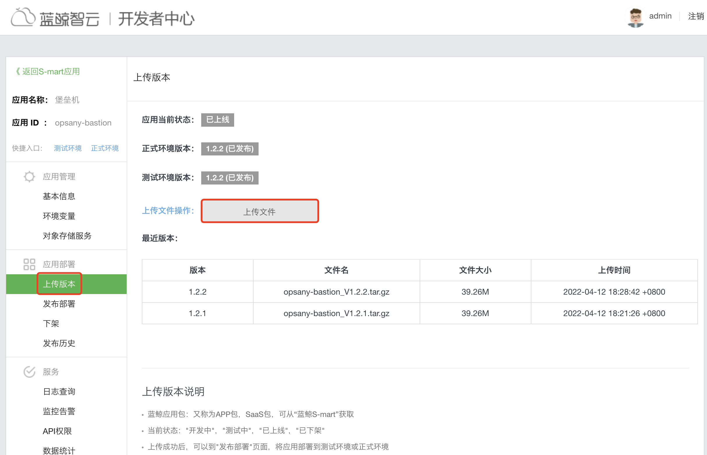
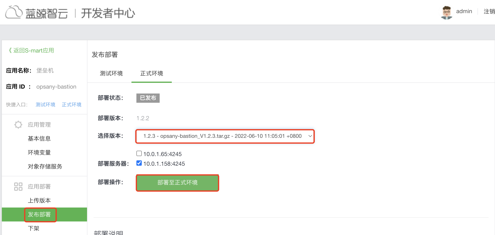

# 生产环境更新部署

更新OpsAny堡垒机需要以下3个步骤。

- 更新最新代码
- 构建SAAS安装包
- 构建Websocket镜像

## 直接使用官方提供的包部署


## 自己手工构建部署

需要先将堡垒机打包为蓝鲸Smart应用的包，然后就可以直接在开发者中心上传部署。

### 构建并部署SAAS包

1. 更新之前克隆的代码并打包。

```
cd /opt/opsany-bastion && git pull
wget -c http://bkopen-1252002024.file.myqcloud.com/common/py36_e.tgz -O /opt/py.tgz
wget -c https://raw.githubusercontent.com/shpdnkti/saas-builder/main/build.sh -O /tmp/build.sh
tar xf /opt/py.tgz -C /opt
chmod +x /tmp/build.sh
APP_VERSION=1.2.3
cd /opt/opsany-bastion && bash /tmp/build.sh -s ./ -d /tmp/release --python3-home /opt/py36_e/bin/python3 --app-code opsany-bastion --app-version $APP_VERSION
```

打包后的文件在/tmp/release目录下，将打包后的文件下载到本地。

```
ls /tmp/release/
opsany-bastion_V1.2.3.tar.gz
```

2. 在开发中心上传并部署OpsAny Bastion

打开蓝鲸【开发者中心】->【S-mart应用】，找到部署的opsany-bastion，点击操作中的【部署】。



上传完毕之后，点击【发布部署】，选择【生产环境】可以进行部署更新。




### 部署堡垒机Websocket容器

堡垒机Websocket是一个独立的服务，默认监听8004端口，使用Docker容器启动，需要准备一台安装了Docker的主机，由于蓝鲸社区版的运行SAAS的Docker没有NAT网卡，所以需要单独一台安装了Docker的主机。

1. 准备websocket配置文件。

> 配置文件也存放在opsany-bastion项目中。

```
#克隆项目代码
cd /opt/opsany-bastion && git pull
#从配置模板生成配置文件
cd /opt/opsany-bastion/install && cp install.config.example install.config
#设置为蓝鲸社区版的访问域名
DOMAIN_NAME=demo.opsany.com
#设置本机的内网IP地址
LOCAL_IP=192.168.56.11


- 启动Websocket容器
```
docker run -d --restart=always --name opsany-bk-websocket \
    -p 8004:8004 -v ${INSTALL_PATH}/logs:/opt/opsany/logs \
    -v ${INSTALL_PATH}/uploads:/opt/opsany/uploads \
    -v ${INSTALL_PATH}/conf/settings_production.py.websocket:/opt/opsany/websocket/config/prod.py \
    -v ${INSTALL_PATH}/conf/settings_production.py.websocket.init:/opt/opsany/websocket/config/__init__.py \
    -v /etc/localtime:/etc/localtime:ro \
    -v /usr/share/zoneinfo:/usr/share/zoneinfo \
    ${PAAS_DOCKER_REG}/opsany-bk-websocket:v1.2.1
```

3. 进入到Websocket容器里增加hosts

需要保证Websocket能和PAAS进行通信，需要绑定hosts，访问到PAAS的Nginx的内网IP地址。

```
docker exec -it opsany-bk-websocket /bin/sh
echo "10.0.1.65 ce.bktencent.com" >>/etc/hosts
```

### 堡垒机测试

恭喜您，完成了部署操作，这是一个经典的蓝鲸SAAS的手工部署流程。
